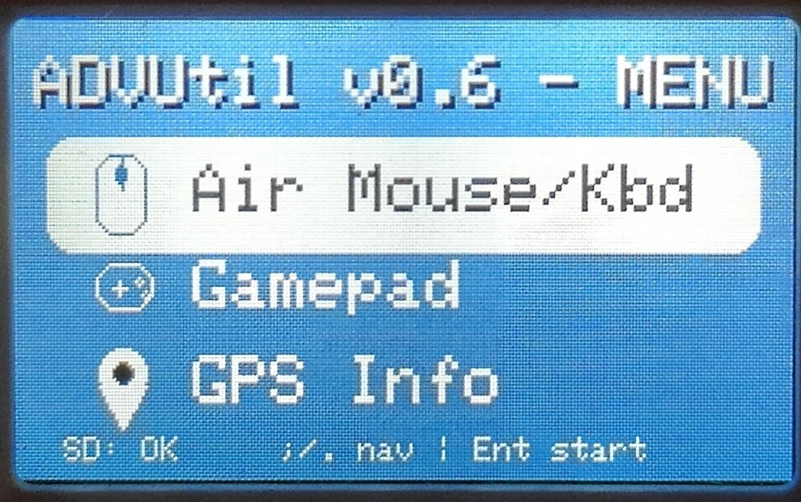
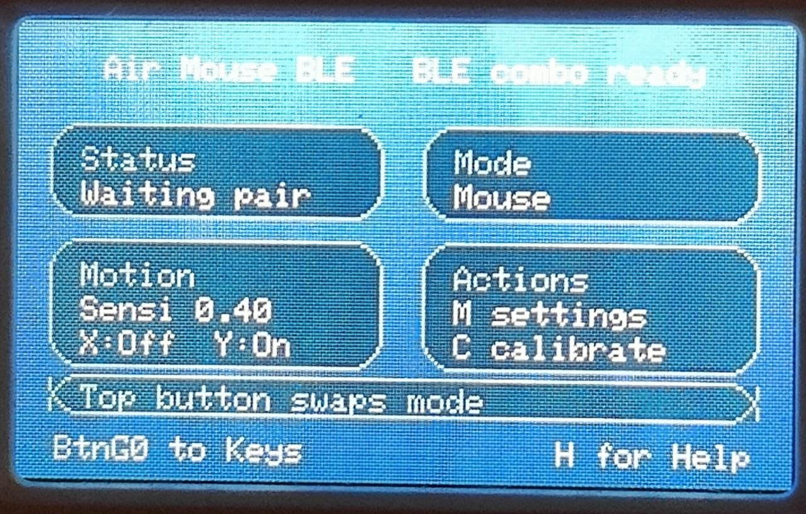
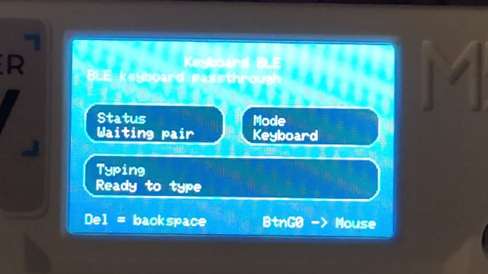
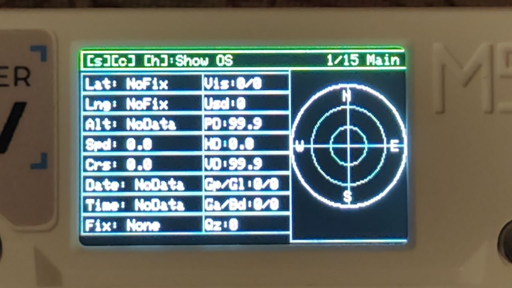
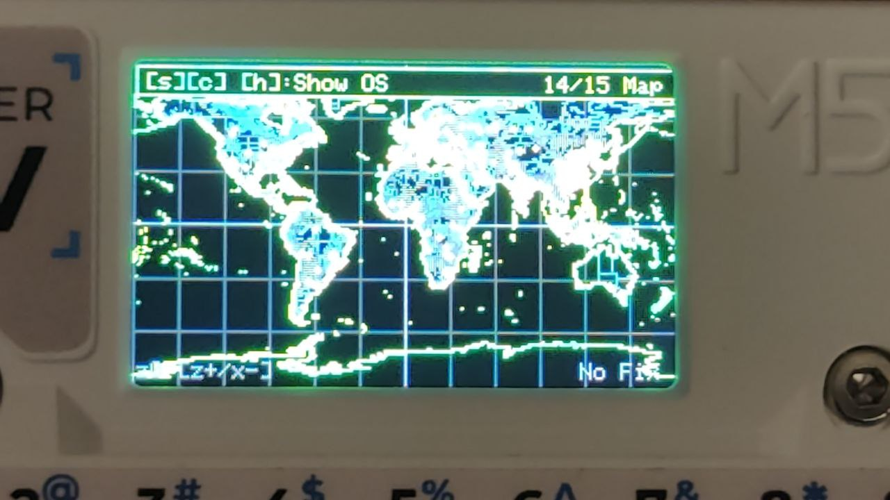

# ADVUtil
AirMouse and GPS integrated

ADVUtil for Cardputer: Air Mouse BLE + GPS Info utility with maps, satellite views, trip stats and more
I’ve been working on ADVUtil, a utility app for the M5Stack Cardputer with two main tools built in:

- Air Mouse BLE Turn the Cardputer into a Bluetooth air mouse using the IMU.

Main features:

Tilt-based mouse control
Left click with Enter
Right click with Space
IMU calibration directly from the device
Adjustable sensitivity
Settings saved to SD card

- GPS Info

A full GPS utility designed for use with the official M5Stack LoRa Cap 1262, based on https://github.com/DevinWatson/Cardputer-Adv-GPS-Info
https://github.com/alcor55/Cardputer-GPS-Info

Main features:

Live GPS data and fix status
Sky view and signal bars
Satellite constellation overview
Coordinates, altitude, speed and course
Trip statistics
Breadcrumb track
Altitude and speed graphs
NMEA monitor
GPS clock
Map view with zoom
3D globe view
Configurable RX / TX / baud settings
Optional slideshow mode between screens
SD card config saving

Important note:
To use the GPS feature, you need an official M5Stack LoRa Cap 1262.

Air Mouse troubleshooting:
If Air Mouse does not work correctly on your PC, the usual fix is:
Disable Bluetooth on the PC
Remove the previously paired Cardputer mouse device
Re-enable Bluetooth
Pair the Cardputer again from scratch

In many cases, reconnecting from zero fixes detection and input issues.
If there is interest, I can also share more screenshots, controls, and build details.

______________________

V0.3 changelog:

New in this version:

Arrow keys can now be used for mouse scrolling
Added a universal back action with Del
Added X/Y axis inversion options for Air Mouse
Added configurable button mapping for left click, right click, middle click, back, and forward
Air Mouse settings are now saved persistently

Thanks to u/Russian_man_ who pointed these out, especially the suggestion about axis inversion and customizable mouse buttons. Those were genuinely useful improvements.

___________________________________
V0.5 changelog:

Added Macro Mode for Air Mouse and Keyboard overlays
Hold BtnA for 2 seconds to enter or exit Macro Mode
Press 1 to 0 to play one of the 10 saved macros
Press R to record or replace a macro, then stop recording with backtick
Press L to view the saved macros in a scrollable list
Macro contents are saved on SD card and restored on startup

___________________________________
V0.4 changelog:

Added a new Bluetooth keyboard mode
You can now press the top button (BtnG0) to switch between Air Mouse mode and Keyboard mode
Air Mouse now uses a BLE combo HID setup, so mouse and keyboard features are integrated in the same Bluetooth device
Exiting Air Mouse mode now requires pressing Del twice, to reduce accidental exits
In Keyboard mode, Del works normally again as backspace
Reworked the Air Mouse UI to better match the main menu style
Cleaned up the main Air Mouse screen layout for better readability
Added H for Help on the Air Mouse screen to show controls and key mappings
Improved the Motion and Actions panels layout
Air Mouse settings UI was restyled to feel more consistent with the rest of the app

Current Air Mouse controls:
BtnG0: switch between Mouse and Keyboard mode
M: open Air Mouse settings
C: calibrate IMU
H: open help
Del twice: exit Air Mouse mode
; and .: mouse wheel
, and /: horizontal scroll

If you update from an older version, you may need to remove the old Bluetooth pairing and pair the Cardputer again, since the HID setup changed in this release.

As always thanks to u/Russian_man_ who pointed these out

If you test the new version, let me know how the new Air Mouse controls feel and whether the default button mappings make sense or should be changed.
